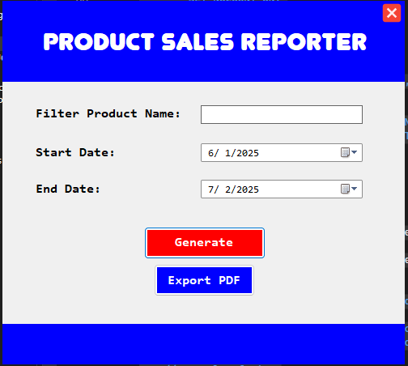
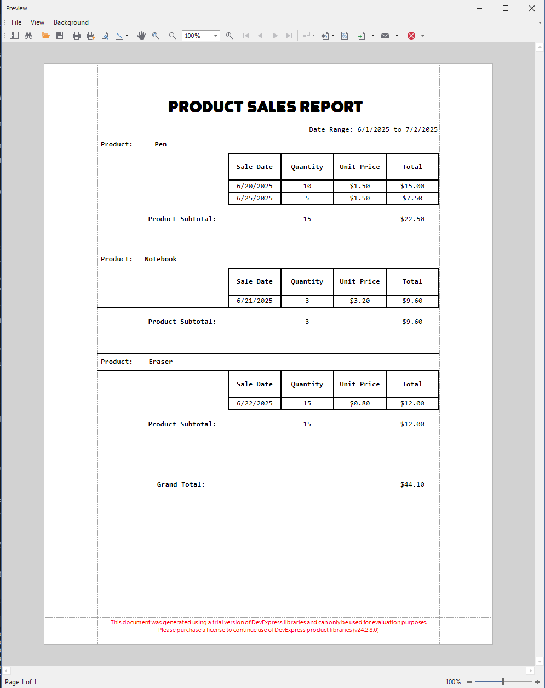

# Product Sales Reporting Tool

This is a C# WinForms application built for a developer coding test. The application connects to a SQL Server database to fetch, filter, and display product sales data using a DevExpress XtraReport.

## Application Preview

## Report Preview

The application presents a simple and intuitive user interface. The main window contains:
- **Date Pickers**: For selecting the start and end dates of the reporting period.
- **Product Name Filter**: A text box for optional filtering by product name.
- **Action Buttons**: Buttons to generate the report, export it to PDF, and close the application.
- **Report Viewer**: A control that displays the generated sales report directly within the window.

## Usage

1.  **Launch the Application**: Run the project from Visual Studio.
2.  **Select Date Range**: Use the date pickers to define the start and end dates for the sales report.
3.  **Filter by Product (Optional)**: To narrow the results, type a partial or full product name into the "Filter by Product Name" text box.
4.  **Generate Report**: Click the **Generate Report** button. The report will be displayed in the report viewer, showing sales data grouped by `ProductCode`.
5.  **Export to PDF**: Click the **Export to PDF** button to save the current report view as a PDF file. You will be prompted to choose a location to save the file.
6.  **Close**: Click the **Close** button to exit the application.

## Features

This project successfully implements all core and bonus requirements.

### Core Features

-   **Database Connectivity**: Connects to a SQL Server database using ADO.NET.
-   **Date Range Filtering**: Allows users to select a start and end date to filter sales data.
-   **Dynamic Reporting**: Uses DevExpress XtraReport to display the fetched data.
-   **Data Grouping**: Groups the report by `ProductCode`.
-   **Calculated Summaries**:
    -   Shows total quantity sold per product.
    -   Shows total revenue per product.
    -   Displays a grand total for all sales in the selected period.
-   **Error Logging**: Logs any SQL connection or query errors to a local file (`logs/errors.txt`).
-   **Validation**: Shows a warning message if no results are found for the selected criteria.

### Bonus Features

-   **Dynamic PDF Export**: A dedicated button allows the user to export the current report as a PDF file.
-   **Filter by Product Name**: An additional textbox allows filtering the report by a partial product name match.
-   **Stored Procedure**: All data is fetched using a secure stored procedure (`sp_GetProductSales`) instead of raw SQL queries.
-   **Report Parameters in Header**: The selected Start Date and End Date are displayed in the report's page header.

## Setup and Installation

Follow these steps to get the project running on your local machine.

### Prerequisites

-   Visual Studio 2019 or later
-   .NET Framework 4.7.2 or later
-   SQL Server (any edition, including Express or LocalDB)
-   DevExpress WinForms Components (v20.1 or later)

### 1. Database Setup

Open SQL Server Management Studio (SSMS) and run the provided `DatabaseSetup.sql` script to create the `PRODUCTSALES` table, the `sp_GetProductSales` stored procedure, and insert sample data.

    -- Create the table
    CREATE TABLE PRODUCTSALES (
        SALEID INT PRIMARY KEY,
        PRODUCTCODE NVARCHAR(20),
        PRODUCTNAME NVARCHAR(100),
        QUANTITY INT,
        UNITPRICE DECIMAL(18, 2),
        SALEDATE DATE
    );
    GO

    -- Insert sample data
    INSERT INTO PRODUCTSALES (SALEID, PRODUCTCODE, PRODUCTNAME, QUANTITY, UNITPRICE, SALEDATE)
    VALUES
    (1, 'P001', 'Pen', 10, 1.50, '2025-06-20'),
    (2, 'P001', 'Pen', 5, 1.50, '2025-06-25'),
    (3, 'P002', 'Notebook', 3, 3.20, '2025-06-21'),
    (4, 'P003', 'Eraser', 15, 0.80, '2025-06-22');
    GO

    -- Create the stored procedure
    CREATE PROCEDURE sp_GetProductSales
        @StartDate DATE,
        @EndDate DATE,
        @ProductName NVARCHAR(100) = NULL
    AS
    BEGIN
        SET NOCOUNT ON;
        SELECT 
            PRODUCTCODE, 
            PRODUCTNAME, 
            QUANTITY, 
            UNITPRICE, 
            (QUANTITY * UNITPRICE) AS TOTAL, 
            SALEDATE 
        FROM PRODUCTSALES 
        WHERE SALEDATE BETWEEN @StartDate AND @EndDate
        AND (@ProductName IS NULL OR PRODUCTNAME LIKE '%' + @ProductName + '%');
    END
    GO

### 2. Connection String

You must update the connection string in the `DataAccess.cs` file to point to your SQL Server instance.

Open the `DataAccess.cs` file and modify the `connectionString` variable:

    // Example for SQL Express LocalDB
    private static readonly string connectionString = "Server=(localdb)\MSSQLLocalDB;Database=YourDatabaseName;Trusted_Connection=True;";

    // Example for a full SQL Server instance
    private static readonly string connectionString = "Server=YOUR_SERVER_NAME;Database=YourDatabaseName;User Id=YourUser;Password=YourPassword;";

    // Example of mine
    private static readonly string connectionString = @"Data Source=(LocalDB)\MSSQLLocalDB;AttachDbFilename=C:\Users\Leeseangbok.JUSTCALLMET\OneDrive\Documents\SaleDB.mdf;Integrated Security=True;Connect Timeout=30";

### 3. Run the Application

1.  Open the `.sln` file in Visual Studio.
2.  Rebuild the solution to restore all NuGet packages.
3.  Press **F5** or click the **Start** button to run the application.
